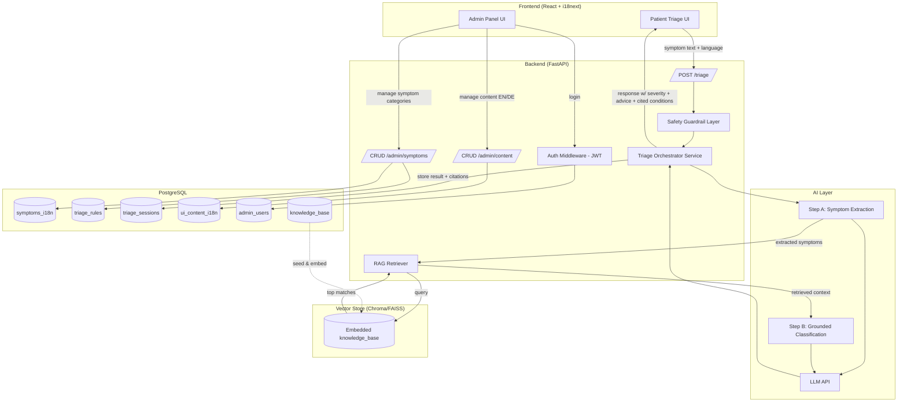
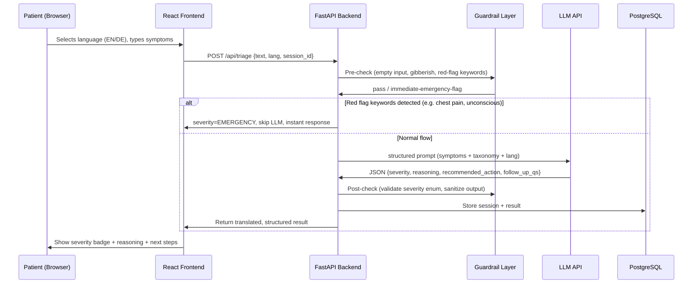

# AI-Powered Clinical Triage Assistant — Full Project Roadmap
**MunichTech EXPO Health Innovation Lab — Digital Health Track**
**Build Window: 10 Days | Bilingual (EN/DE) | Owner: Vedant**

---

## 1. Project Overview

### 1.1 Problem Statement
Emergency and urgent-care facilities face bottlenecks because patients cannot self-assess the urgency of their symptoms before arriving or calling in. A digital triage assistant lets a patient (or front-desk staff) describe symptoms in natural language and receive an instant, explainable urgency classification, so that:
- Critical cases get flagged/escalated immediately.
- Non-critical cases get routed to the right care level (self-care / GP / urgent care / ER).
- Hospitals reduce unnecessary ER load.

### 1.2 What We're Building
A full-stack web app with three surfaces:
1. **Patient-facing Triage App** — conversational/form-based symptom intake → AI-generated triage result (severity level, reasoning, recommended next step).
2. **Admin Panel** — manage symptom categories, triage rules, disclaimers, and all UI content in **English and German**, with English as default.
3. **API Backend** — orchestrates LLM reasoning, applies safety guardrails, stores sessions, serves translated content.

### 1.3 Success Criteria for Demo Day
- Live demo: patient enters symptoms → gets a triage result in under 5 seconds, in EN or DE.
- Admin can add/edit a symptom category or a translation live, and it reflects instantly on the patient app.
- Clear safety disclaimer shown ("not a medical diagnosis, call emergency services for life-threatening symptoms").
- Judges can see architecture diagram + explainability of the AI's reasoning (not a black box).

### 1.4 Explicit Non-Goals (to protect the 10-day timeline)
- No real EHR/hospital system integration.
- No user authentication for patients (session-based, anonymous).
- No mobile app — responsive web only.
- No training of a custom ML model — LLM API + a deterministic rules layer on top, plus RAG grounding (Section 8).
- Image-based visual observation is **scoped to Eyes and Skin only** (Section 10) — Teeth/Dental and all other categories are text-intake only for v1; image support for them is a stretch goal (Section 20), not a commitment.
- Image observation **never outputs a percentage, severity score, or definitive diagnosis** — qualitative, non-diagnostic language only (Section 10.1). This is a hard rule, not a placeholder to "improve later."

### 1.5 Why This Is Genuinely AI-Powered (not a form with a chatbot bolt-on)
The topic's core requirement is "AI-Powered" — so the AI must be doing real reasoning work, visible to the judges, not just a single hidden API call behind a static form. This project makes the AI the centerpiece in four concrete ways:

1. **AI-driven symptom extraction** — the LLM parses free-text patient input (not just dropdown selections) and extracts structured symptoms, duration, and severity cues from natural language, in either English or German.
2. **AI clinical reasoning, not a lookup table** — severity classification comes from the LLM reasoning over the extracted symptoms against triage principles, not a simple keyword-to-severity map (the keyword layer only exists as a safety net for unmissable emergencies — see Section 7.1).
3. **AI-generated explainability** — every result includes the model's own plain-language reasoning for *why* it chose that severity, shown to the user and logged for judges to inspect (this is the single biggest "wow" factor in a live demo — it proves the AI isn't a black box).
4. **AI-driven adaptive follow-up questioning** — when confidence is low or symptoms are ambiguous, the AI generates 1-2 targeted clarifying questions itself (not from a fixed script) before finalizing severity — a genuine multi-turn reasoning loop, not a single-shot classifier.

When you pitch this, lead with these four points before touching the tech stack — it directly answers "how is this AI-powered" before a judge has to ask.

---

## 2. Tech Stack

| Layer | Choice | Why |
|---|---|---|
| Frontend | React (Vite) + TailwindCSS | Fast dev, matches your existing stack |
| i18n (frontend) | `react-i18next` | Industry standard, easy admin-driven overrides |
| Backend | FastAPI (Python) | Fast, async, matches your stack, easy LLM SDK integration |
| Database | PostgreSQL | Relational, clean bilingual schema, free-tier hosting available |
| ORM | SQLAlchemy + Alembic (migrations) | Standard with FastAPI |
| AI Reasoning | LLM API (Anthropic Claude or OpenAI — pick one, keep provider swappable via `.env`) | No training needed, fast to build, explainable via structured prompting |
| Embeddings | `sentence-transformers` (local, free, e.g. `all-MiniLM-L6-v2`) | No API cost/latency for embedding the knowledge base and queries |
| Vector Store | ChromaDB or FAISS (local, file-based) | RAG retrieval layer, Section 8 — no separate server needed, keeps infra simple for a 10-day build |
| Auth (admin only) | JWT-based simple login | Only admin panel needs auth |
| Hosting (demo) | Frontend → Vercel/Netlify; Backend → Render/Railway; DB → Supabase/Neon (Postgres) | Free tiers, fast deploy |
| Diagrams | Mermaid (included below) | Renders directly in GitHub/most markdown viewers |

---

## 3. System Architecture



---

## 4. End-to-End Data Flow (Patient Triage Request)



---

## 5. Database Schema

### 5.1 `symptoms_i18n`
| Column | Type | Notes |
|---|---|---|
| id | UUID PK | |
| code | VARCHAR (unique) | e.g. `chest_pain` |
| label_en | TEXT | |
| label_de | TEXT | |
| category | VARCHAR | e.g. cardiac, respiratory, general |
| red_flag | BOOLEAN | true = auto-emergency keyword |

### 5.2 `triage_rules`
| Column | Type | Notes |
|---|---|---|
| id | UUID PK | |
| symptom_code | FK → symptoms_i18n.code | |
| severity_level | ENUM(`emergency`,`urgent`,`routine`,`self_care`) | |
| advice_en | TEXT | |
| advice_de | TEXT | |

### 5.3 `triage_sessions`
| Column | Type | Notes |
|---|---|---|
| id | UUID PK | |
| input_text | TEXT | raw patient input (all rounds, appended) |
| language | VARCHAR(2) | `en` / `de` |
| extracted_symptoms | JSONB | Step A output — structured symptoms/duration/descriptors (Section 7.2) |
| severity_result | VARCHAR | final severity, null until resolved |
| confidence_score | FLOAT | Step B output (Section 7.3) |
| ai_reasoning | TEXT | stored for audit/demo transparency |
| follow_up_rounds | INT | how many clarifying-question rounds occurred (0-2) |
| triggered_by | VARCHAR | `guardrail` or `llm` — which layer produced the final severity |
| created_at | TIMESTAMP | |

### 5.4 `ui_content_i18n`
Generic key-value table so **any** admin-editable UI text (headers, disclaimers, buttons) is bilingual.

| Column | Type | Notes |
|---|---|---|
| id | UUID PK | |
| key | VARCHAR (unique) | e.g. `disclaimer_banner` |
| value_en | TEXT | |
| value_de | TEXT | |
| updated_at | TIMESTAMP | |

### 5.5 `admin_users`
| Column | Type | Notes |
|---|---|---|
| id | UUID PK | |
| email | VARCHAR unique | |
| password_hash | VARCHAR | |
| created_at | TIMESTAMP | |

> **Bilingual design principle:** every content table gets a `_en` and `_de` column pair, never separate rows per language. This means one admin edit updates both languages in a single form, and English is always the fallback if a German field is left blank.

---

## 6. Bilingual (EN/DE) System Design

### 6.1 Default Language Logic
- Default language = **English**, on both patient app and admin panel.
- Language switcher (EN | DE) visible top-right on every page.
- Selected language stored in `localStorage` (frontend) — no login needed for patients.
- Frontend static strings (buttons, labels, nav) → `react-i18next` JSON files:
  - `/src/locales/en.json`
  - `/src/locales/de.json`
- Dynamic/admin-editable content (symptom names, disclaimers, advice text) → served from DB `_en`/`_de` columns via API, **not** hardcoded in frontend JSON.

### 6.2 Admin Panel Behavior (your explicit requirement)
- Every "Add/Edit" form in admin (symptoms, triage advice, UI banners) shows **two fields side by side**: English (required) and German (optional, falls back to English if empty).
- One save action → writes both columns in one API call → both languages update atomically.
- No separate "switch to German mode and re-enter everything" — single form, both languages, single submit.

### 6.3 LLM Output Language
- The `lang` parameter is passed into the LLM prompt so reasoning/advice text generated live is also returned in the requested language, while the structured `severity` enum stays language-independent (`emergency|urgent|routine|self_care`) so your frontend badge colors/logic never depend on text matching.

---

## 7. Triage Logic & LLM Prompt Design

### 7.1 Two-Layer Safety Approach (important for judges — shows you're not just "wrapping an API")
1. **Deterministic Guardrail Layer (runs first, no LLM):** keyword-matches input against `red_flag=true` symptoms (e.g. "chest pain", "can't breathe", "unconscious", "severe bleeding"). If matched → instantly return `EMERGENCY` without waiting on the LLM. This is your fastest, most reliable safety net.
2. **LLM Reasoning Layer (for everything else):** structured prompt forces JSON output.

### 7.2 Step A — AI Symptom Extraction (structured NLP pass)
Before classification, the LLM first converts free-text patient input into structured data — this is a distinct AI call/step, not folded silently into classification, so it's demonstrable on its own:
```
You are a medical symptom extraction engine. Do NOT diagnose or classify urgency.
From the patient's free-text description below, extract:
{
  "symptoms": ["string", ...],       // normalized symptom names
  "duration": "string|null",         // e.g. "2 days", "since this morning"
  "severity_descriptors": ["string"],// e.g. "worsening", "sudden onset", "mild"
  "affected_area": "string|null"
}
Patient input ({language}): "{raw_text}"
Output strict JSON only.
```
This extracted object is stored in `triage_sessions.extracted_symptoms` (add this column) — so the admin session log shows the AI's structured understanding of the patient, not just raw text. Strong demo point.

### 7.3 Step B — AI Severity Classification with Confidence Score
```
You are a clinical triage support assistant. You do NOT diagnose.
Given the extracted symptom data below, classify urgency into exactly one of:
EMERGENCY | URGENT | ROUTINE | SELF_CARE

Rules:
- If ANY life-threatening symptom is plausible, choose EMERGENCY.
- Always explain your reasoning in 2-3 plain sentences, in {language}.
- Always include a "recommended_action" in {language}.
- Provide a "confidence" score 0.0-1.0 for your classification.
- If confidence < 0.6, propose up to 2 targeted clarifying questions instead of finalizing.
- Never provide a diagnosis or medication dosage.

Extracted data: {structured_symptoms_json}

Output strict JSON only, matching this schema:
{
  "severity": "EMERGENCY|URGENT|ROUTINE|SELF_CARE",
  "confidence": 0.0,
  "reasoning": "string",
  "recommended_action": "string",
  "follow_up_questions": ["string", "string"]
}
```

### 7.4 Step C — Adaptive Multi-Turn Loop (the real "AI-powered" differentiator)
If `confidence < 0.6` and `follow_up_questions` is non-empty:
- Frontend shows the AI's own follow-up question(s) to the patient instead of a final result.
- Patient's answer is appended to the conversation context and Step B is re-run (max 2 rounds, to keep the demo fast and avoid infinite loops).
- Once confidence ≥ 0.6 or the round limit is hit, the final result is returned and stored.

This turns the assistant from a single-shot classifier into a genuine reasoning conversation — the single strongest thing to demo live, since judges watch the AI ask a smart follow-up question in real time rather than just spitting out a label.

### 7.5 Output Validation
- Backend validates each LLM JSON response (extraction, classification) against its own Pydantic schema before use.
- If validation fails or LLM errors out at any step → fallback to `ROUTINE` + a generic "please consult a doctor" message (never fail silently, never crash the UI).
- Both AI steps (extraction + classification) and every follow-up round are logged to `triage_sessions` so the full reasoning chain is auditable — this is what makes the AI explainable rather than a black box.

---

## 8. Knowledge Grounding via Multi-Dataset RAG — Your Uniqueness Layer

This is what separates your project from every other team that just wraps a raw LLM call. Instead of letting the AI answer purely from its own trained knowledge, the system **retrieves real medical reference data first**, then reasons over it — this is Retrieval-Augmented Generation (RAG), and it's both a genuine accuracy improvement and your strongest "why is this unique" talking point.

### 8.1 Why This Matters (say this to judges)
- A bare LLM call can hallucinate or give generic advice. A RAG-grounded system retrieves actual disease-symptom relationships from real datasets before answering — so its reasoning is **traceable to a source**, not just "the model said so."
- **Important honesty point (also a strength, not a weakness, to state out loud in your pitch):** no AI system — including this one — can guarantee 100% diagnostic accuracy. What RAG grounding *does* guarantee is that every recommendation is backed by a retrievable, citable data point, and the system is transparent about its own confidence (Section 7.3) rather than pretending certainty it doesn't have. Judges in health-tech consistently reward this kind of responsible framing over overconfident claims.

### 8.2 Datasets to Integrate (all public, free, no licensing blockers)
| Dataset | What it gives you | Use |
|---|---|---|
| **Disease-Symptom Knowledge Database** (Kaggle: "Disease Symptom Prediction" / SymCat-derived sets) | ~40+ diseases mapped to symptom lists with frequency weights | Core symptom→disease association retrieval |
| **WHO ICD-10/ICD-11 codes (public API/CSV)** | Standardized disease classification & naming | Ground disease names to an internationally recognized coding standard — big credibility point |
| **MedlinePlus / NHS Conditions dataset (public summaries)** | Plain-language descriptions of conditions, typical severity, when to seek care | Feeds the "recommended_action" text with real guidance phrasing, not model-invented advice |
| **Open symptom-checker datasets (e.g. from academic triage research, publicly released)** | Real triage-level labels (emergency/urgent/routine) tied to symptom clusters | Validates/calibrates your `triage_rules` table (Section 5.2) against real-world triage logic |

You don't need all four to look strong — even two (Disease-Symptom DB + ICD codes) integrated well beats a single-dataset or zero-dataset system. Pick based on what's cleanly downloadable in the first 2 days; don't burn time chasing a "perfect" dataset.

### 8.3 Technical Implementation — Simple, Fast, No Heavy Infra
1. **Preprocess datasets** into a normalized table: `condition_name`, `associated_symptoms[]`, `typical_severity`, `source_dataset`, `guidance_text_en`, `guidance_text_de` (translate guidance text once during seeding, not live).
2. **Embed** each row's symptom/condition text using a free embedding model (e.g. `sentence-transformers/all-MiniLM-L6-v2`, runs locally, no API cost).
3. **Store vectors** in a lightweight local vector store — **ChromaDB** or **FAISS** (both free, file-based, no separate server needed — keeps your 10-day infra simple).
4. **At query time:** after Step A (symptom extraction, Section 7.2), embed the extracted symptoms and retrieve the top 3-5 closest matching conditions from the vector store.
5. **Pass retrieved context into Step B's prompt** (Section 7.3) as grounding evidence — the LLM reasons over *this retrieved data*, not just its own memory, and must cite which retrieved condition(s) informed its answer.

### 8.4 Updated Step B Prompt (replaces the version in Section 7.3 — now RAG-grounded)
```
You are a clinical triage support assistant. You do NOT diagnose.
Given the extracted symptom data AND the retrieved reference conditions below,
classify urgency into exactly one of:
EMERGENCY | URGENT | ROUTINE | SELF_CARE

Rules:
- Base your reasoning primarily on the retrieved reference data below — do not
  contradict it without strong justification.
- If ANY life-threatening symptom is plausible, choose EMERGENCY.
- Cite which retrieved condition(s) most influenced your classification.
- Always explain your reasoning in 2-3 plain sentences, in {language}.
- Always include a "recommended_action" in {language}, drawing from the
  retrieved guidance_text where relevant.
- Provide a "confidence" score 0.0-1.0 for your classification.
- If confidence < 0.6, propose up to 2 targeted clarifying questions instead
  of finalizing.
- Never provide a diagnosis or medication dosage.

Extracted patient data: {structured_symptoms_json}
Retrieved reference conditions (top matches): {retrieved_context_json}

Output strict JSON only, matching this schema:
{
  "severity": "EMERGENCY|URGENT|ROUTINE|SELF_CARE",
  "confidence": 0.0,
  "reasoning": "string",
  "recommended_action": "string",
  "cited_conditions": ["string", ...],
  "follow_up_questions": ["string", "string"]
}
```

### 8.5 New DB Table: `knowledge_base`
| Column | Type | Notes |
|---|---|---|
| id | UUID PK | |
| condition_name | VARCHAR | e.g. "Angina", "Gastroenteritis" |
| icd_code | VARCHAR | from WHO ICD dataset, nullable |
| associated_symptoms | JSONB | array of symptom strings |
| typical_severity | VARCHAR | reference severity from source dataset |
| guidance_text_en | TEXT | |
| guidance_text_de | TEXT | |
| source_dataset | VARCHAR | which dataset this row came from — shown in admin for transparency |
| embedding_vector | (stored in Chroma/FAISS, not Postgres) | referenced by `id` |

### 8.6 Demo Payoff
Live demo becomes: patient describes symptoms → screen briefly shows "matching against medical knowledge base..." → result appears **with the specific retrieved condition(s) named** ("This matches patterns associated with [Condition], per [source dataset]") → judges see a system that reasons from real data with a visible paper trail, not a black-box guess. This single feature is very likely to be the differentiator between your project and most others in the room.

---

## 9. Multi-Category Health Assessment System

Instead of one generic "describe your symptoms" box, the patient first picks a **category** — this makes the intake more structured (better AI accuracy), more intuitive for the patient, and gives you a clean way to showcase breadth in the demo.

### 9.1 Categories (v1)
| Category | Intake type | Notes |
|---|---|---|
| Eyes | Text symptoms + optional image (Section 10) | |
| Skin | Text symptoms + optional image (Section 10) | |
| Teeth / Dental | Text symptoms only (v1) | Image support is a stretch goal — Section 20 |
| Heart / Cardiac | Text symptoms only | High red-flag sensitivity — always routed through guardrail layer first |
| Digestion / GI | Text symptoms only | |
| Diabetes / Metabolic | Text symptoms + optional numeric inputs (e.g. known blood sugar reading, if patient has it) | |
| Weight / Nutrition | Text symptoms + optional numeric inputs (weight, height for BMI context) | This one is closer to general wellness guidance than urgent triage — keep tone accordingly |
| General / Other | Text symptoms (fallback) | Catches anything not fitting above |

### 9.2 How It Changes the Pipeline
- `knowledge_base` (Section 8.5) gets a `category` column — RAG retrieval (Section 8.3) filters to the selected category first, which meaningfully improves retrieval precision (smaller, more relevant search space).
- `symptoms_i18n.category` (already in schema, Section 5.1) drives which quick-select symptom chips appear per category screen.
- Step A extraction prompt (Section 7.2) includes the selected category as context, so extraction is tuned to that domain's vocabulary.

### 9.3 Frontend Flow
- New landing screen: category grid (icon + label per category, bilingual) → patient taps one → routed into that category's intake flow.
- Categories with image support (Eyes, Skin) show an extra "Add a photo (optional)" step before submitting.

---

## 10. Image-Based Visual Observation (Eyes + Skin only — Phase 1)

### 10.1 Scope Decision (important — read before building)
This is scoped to **two categories only (Eyes, Skin)**, and it gives **qualitative observations, never a percentage or a diagnosis**. This is a deliberate safety and honesty decision, not a limitation to apologize for:
- A single phone photo analyzed by a general multimodal AI cannot match real clinical imaging (fundus cameras, dermatoscopes) — claiming an exact "% damage" figure would be presenting false precision on a health matter, which is genuinely harmful if a patient believes it.
- What a multimodal LLM *can* do reasonably well: describe visible features (redness, swelling, discoloration, visible lesion pattern) and note if they're commonly associated with certain conditions — always framed as "worth having a professional look at," never as a result.

**In your pitch, state this limitation openly.** It reads as engineering maturity, not a gap — you're the team that built the guardrails everyone else's demo will be missing.

### 10.2 How It Works
1. Patient uploads a photo (eye or skin area) — client-side compressed before upload.
2. Backend sends the image + a structured observation prompt to a vision-capable LLM (e.g. Claude with vision, or GPT-4V).
3. Prompt constraints:
```
You are a visual observation assistant. You do NOT diagnose and must NEVER
output a percentage, severity score, or definitive condition name as fact.
Describe only visible features (color, swelling, texture, visible patterns).
State clearly this is not a medical diagnosis. If the image is unclear, low
quality, or you cannot make a confident observation, say so explicitly rather
than guessing. Output in {language}.

Output strict JSON only:
{
  "visible_features": ["string", ...],
  "general_note": "string",     // plain-language, non-diagnostic
  "recommend_professional_check": true,
  "image_quality_sufficient": true|false
}
```
4. Result is combined with the RAG knowledge base (Section 8) for that category — the retrieved conditions are shown as "may be worth discussing with a doctor," not as a determined result.
5. Displayed to the patient as an **"Observation" card** — visually distinct from the text-based "Triage Result" card (different label, softer color, no severity badge), so it's never confused with an actual diagnosis.

### 10.3 New DB Table: `visual_assessments`
| Column | Type | Notes |
|---|---|---|
| id | UUID PK | |
| session_id | FK → triage_sessions.id | |
| category | VARCHAR | `eyes` or `skin` (v1) |
| visible_features | JSONB | |
| general_note | TEXT | |
| image_quality_sufficient | BOOLEAN | |
| created_at | TIMESTAMP | |

**Privacy note:** don't persist the raw uploaded image beyond the request lifecycle unless you explicitly need it for the demo replay — process it, store only the text observation, and discard the image. Mention this data-handling choice in your pitch; judges in health-tech notice privacy hygiene.

### 10.4 Frontend
- `VisualCheckPage.jsx` — upload UI (drag/drop or camera capture on mobile), preview, submit.
- `ObservationCard.jsx` — separate component from `TriageResultCard`, clearly labeled "AI Visual Observation — Not a Diagnosis."

---

## 11. PDF Report Generation

### 11.1 What It Looks Like
A clean, doctor-visit-style PDF the patient can download after their triage session — this is a strong demo closer ("and here's the report you'd actually walk away with").

**Report contents:**
- Header: app name/logo, report date, session reference ID.
- Patient info block: Name, Age, Blood Group (all optional at intake — see 11.2).
- Category assessed (e.g. "Eyes").
- Triage result: severity badge, AI reasoning, recommended action.
- Cited reference conditions (from Section 8.4), with a line noting these are AI-assisted references, not a confirmed diagnosis.
- Visual observation section (if applicable, Section 10) — clearly marked non-diagnostic.
- Footer disclaimer (bilingual): "This report is generated by an AI decision-support tool. It is not a medical diagnosis. Please consult a licensed healthcare professional."

### 11.2 Patient Info Capture
Add an optional short form before/after triage (never blocking — a patient in urgent distress shouldn't be stuck filling a form first):
- Name (text, optional)
- Age (number, optional)
- Blood Group (dropdown: A+/A-/B+/B-/AB+/AB-/O+/O-/Unknown, optional)

New columns on `triage_sessions`: `patient_name`, `patient_age`, `patient_blood_group` — all nullable. If left blank, the PDF simply omits that line rather than showing "N/A" everywhere (cleaner output).

### 11.3 Technical Implementation
- Library: **WeasyPrint** (HTML/CSS → PDF, easiest to style consistently with your web UI's design system, Section 16) or **ReportLab** if you want more layout control.
- Endpoint: `GET /api/triage/{session_id}/report.pdf?lang=en|de` — generates on demand from stored session data (don't pre-generate/store PDFs, keeps things simple).
- Use the same color system and typography from Section 16 so the PDF visually matches the web app — reinforces a polished, single product feel.

### 11.4 Frontend
- "Download Report (PDF)" button on the Triage Result screen, calls the endpoint and triggers download.
- Button also available from `AdminSessionsPage` (Section 15.1) so staff can pull a patient's report too.

---

## 12. API Endpoints

| Method | Endpoint | Purpose | Auth |
|---|---|---|---|
| GET | `/api/categories` | List assessment categories (Section 9) | None |
| POST | `/api/triage` | Submit symptoms (with category + optional patient info), get triage result | None |
| POST | `/api/visual-check` | Submit image for a session (eyes/skin only), get observation | None |
| GET | `/api/triage/{session_id}/report.pdf` | Generate/download bilingual PDF report (Section 11) | None |
| GET | `/api/content/{key}` | Get bilingual UI content by key | None |
| GET | `/api/symptoms` | List symptom taxonomy (for autocomplete), filterable by category | None |
| POST | `/api/admin/login` | Admin login → JWT | None |
| GET | `/api/admin/symptoms` | List all symptoms (admin view) | JWT |
| POST | `/api/admin/symptoms` | Add symptom (en+de) | JWT |
| PUT | `/api/admin/symptoms/{id}` | Edit symptom (en+de) | JWT |
| DELETE | `/api/admin/symptoms/{id}` | Delete symptom | JWT |
| GET | `/api/admin/knowledge-base` | List/manage knowledge_base entries (Section 8.5) | JWT |
| GET | `/api/admin/content` | List all UI content keys | JWT |
| PUT | `/api/admin/content/{key}` | Edit UI content (en+de) | JWT |
| GET | `/api/admin/sessions` | View triage session log (demo/analytics) | JWT |

---

## 13. Frontend Structure

```
/src
  /locales
    en.json
    de.json
  /components
    LanguageSwitcher.jsx
    SymptomInputForm.jsx
    TriageResultCard.jsx        # severity badge + reasoning + action
    DisclaimerBanner.jsx
    AdminBilingualField.jsx     # reusable EN/DE input pair
    AdminSidebar.jsx
  /pages
    TriagePage.jsx              # main patient flow
    AdminLoginPage.jsx
    AdminDashboardPage.jsx
    AdminSymptomsPage.jsx
    AdminContentPage.jsx
    AdminSessionsPage.jsx       # view past triage sessions (demo value)
  /services
    api.js                      # axios instance
    triageService.js
    adminService.js
  /context
    LanguageContext.jsx
    AuthContext.jsx
  App.jsx
  main.jsx
```

## 14. Backend Structure

```
/app
  main.py
  /api
    triage.py
    admin_symptoms.py
    admin_content.py
    admin_auth.py
  /core
    config.py          # env vars: LLM_PROVIDER, LLM_API_KEY, DB_URL, JWT_SECRET
    security.py         # JWT auth
  /services
    triage_orchestrator.py
    guardrail.py         # red-flag keyword layer
    llm_client.py         # provider-agnostic wrapper
  /models
    symptom.py
    triage_rule.py
    triage_session.py
    ui_content.py
    admin_user.py
  /schemas
    triage_schema.py     # Pydantic request/response models
    content_schema.py
  /db
    session.py
    base.py
  /migrations             # Alembic
requirements.txt
.env.example
```

---

## 15. Admin Panel — Feature Spec

| Feature | Detail |
|---|---|
| Login | Email + password → JWT stored in httpOnly cookie or localStorage |
| Symptom Manager | Table view (code, category, EN label, DE label, red-flag toggle) + Add/Edit modal with bilingual fields |
| Triage Advice Manager | Per symptom, set severity + EN/DE advice text |
| UI Content Manager | Key-value editor for banners/disclaimers/labels, EN/DE side by side |
| Session Log | Read-only table of past triage requests (input, result, language, timestamp) — great for demo storytelling ("look, it logged and reasoned correctly") |
| Language default toggle | Global setting: default language for new visitors (EN by default) |

---

## 16. Visual Design Theme — Why This Must Look Like a Real Medical Product

This is a judged hackathon — a generic gray-and-blue admin-template look will hurt you even if the logic is perfect. The UI must read as **clinical, trustworthy, calm** — not playful, not a generic SaaS dashboard.

### 12.1 Color System
| Purpose | Color | Notes |
|---|---|---|
| Primary brand | Deep clinical teal (`#0F766E`) or medical blue (`#1D4ED8`) | Trust, calm — avoid bright/playful colors |
| Emergency severity | `#DC2626` (red) | Only ever used for EMERGENCY — never elsewhere, so it stays alarming |
| Urgent severity | `#EA580C` (orange) | |
| Routine severity | `#CA8A04` (amber/yellow) | |
| Self-care severity | `#16A34A` (green) | |
| Background | Off-white / very light gray (`#F8FAFC`) | Not pure white — softer, clinical feel |
| Text | Dark slate (`#1E293B`), not pure black | |

Severity colors are used **nowhere else** in the UI (not in nav, not in buttons) — so when a user sees red, it must mean EMERGENCY and nothing else. This restraint is itself a UX safety feature you can point out to judges.

### 12.2 Typography & Iconography
- A clean, highly legible sans-serif (e.g. Inter, IBM Plex Sans — free, professional, used in real health-tech products).
- Medical-appropriate icons only: stethoscope, heartbeat pulse line, cross/plus symbol, clipboard — avoid generic tech icons (rockets, lightning bolts, gears) that make it look like a generic startup app.
- No stock "AI robot" imagery — it undercuts clinical trust. If you want a hero visual, use a simple pulse-line/ECG-wave motif or an abstract care-pathway illustration instead.

### 12.3 Layout Principles
- **Patient app:** single-column, generous whitespace, one primary action visible at a time (no cluttered dashboard feel) — mirrors how real triage/telehealth intake flows are designed (calm, low-anxiety for someone possibly unwell).
- **Severity result card:** the largest, most visually dominant element on the results screen — colored badge + icon + short text, not buried under paragraphs.
- **Admin panel:** can look more "dashboard-like" (tables, sidebar) since it's for staff, not patients — but keep the same color system for consistency.
- **Disclaimer banner:** persistent, high-contrast but not alarming (neutral slate background, not red) — red is reserved for actual emergencies only.

### 12.4 Trust Signals to Include
- Small footer/header note: "Decision-support tool — not a substitute for professional medical advice" (translated EN/DE).
- Visible "How this works" link/section explaining the two-layer guardrail + LLM approach in plain language — judges and users both reward transparency over black-box AI.
- Session reference ID shown after each triage result (ties to `triage_sessions` table) — signals the system is auditable, a real product concern in healthcare software.

---

## 17. UI/UX Notes (Patient App)

- **Landing:** short intro + big disclaimer banner (non-dismissible, translated) + "Start Triage" button.
- **Symptom Input:** free-text box + optional quick-select chips from `symptoms_i18n` (autocomplete) for faster, more structured input.
- **Loading state:** show "Analyzing symptoms..." (translated) while waiting on API.
- **Result Card:**
  - Color-coded severity badge (Red=Emergency, Orange=Urgent, Yellow=Routine, Green=Self-care).
  - AI reasoning (2-3 sentences).
  - **"Matched against" chip row** — shows the retrieved condition name(s) the AI cited (Section 8.4), with source dataset noted on hover/tap — this is the visible proof of RAG grounding for the demo.
  - Recommended action (button-style, e.g. "Call Emergency Services" for EMERGENCY).
  - Follow-up questions (shown inline when confidence is low, per Section 7.4 — this is a core flow, not a stretch goal).
- **Language switcher:** persistent top bar, EN default.

---

## 18. Day-Wise 10-Day Roadmap

### Day 1 — Setup & Architecture
- Init GitHub repo (frontend + backend as monorepo or two repos).
- Set up FastAPI skeleton + PostgreSQL (Supabase/Neon) + Alembic migrations.
- Set up React + Vite + Tailwind + react-i18next skeleton.
- Finalize `.env` structure (LLM key, DB url, JWT secret).
- Deliverable: both apps run locally, "Hello World" connected end to end.

### Day 2 — Database & Models + Knowledge Base Sourcing
- Build all 6 tables (schema above, including `knowledge_base`) via SQLAlchemy models + Alembic migration.
- Seed `symptoms_i18n` with ~20-30 common symptoms (EN+DE) across categories (cardiac, respiratory, GI, general, mental health).
- Seed `ui_content_i18n` with core UI strings (disclaimer, headers, buttons).
- **Download and preprocess 2 RAG datasets** (Section 8.2 — start with Disease-Symptom DB + ICD-10 codes; add MedlinePlus/triage-label data later if time allows). Normalize into the `knowledge_base` schema, translate `guidance_text_de` (can use LLM-assisted translation, human-reviewed).
- Deliverable: DB fully migrated + seeded, `knowledge_base` populated with 40+ conditions from real datasets, viewable via a DB client.

### Day 3 — Backend Core: Triage Endpoint (guardrail layer) + Embeddings
- Build `guardrail.py`: red-flag keyword matcher against `symptoms_i18n`.
- Build `/api/triage` endpoint returning guardrail-only result first (LLM not yet wired).
- Write Pydantic request/response schemas.
- **Embed all `knowledge_base` rows** using a local sentence-transformer model, store vectors in ChromaDB/FAISS (Section 8.3).
- Deliverable: POST request with "chest pain" returns EMERGENCY instantly (no LLM yet); vector store built and a manual similarity-search test returns sensible matches.

### Day 4 — LLM Integration (the core AI + RAG pipeline)
- Build `llm_client.py` (provider-agnostic wrapper for Anthropic/OpenAI).
- Implement Step A (symptom extraction prompt, Section 7.2).
- Build `RAG Retriever` (`B7` in architecture) — embed extracted symptoms, query vector store, return top 3-5 matches.
- Implement Step B (RAG-grounded classification + confidence prompt, Section 8.4) using retrieved context.
- Wire all steps into `triage_orchestrator.py` for non-red-flag cases; store `extracted_symptoms`, `confidence_score`, and `cited_conditions`.
- Implement Step C adaptive follow-up loop (Section 7.4) — re-invoke Step B with appended context, capped at 2 rounds.
- Add output validation (Pydantic schema check per step + fallback logic).
- Deliverable: full `/api/triage` flow working end-to-end via Postman/curl — including a result that visibly cites a retrieved condition, and a low-confidence input that triggers a real follow-up question — both languages tested.

### Day 5 — Frontend: Category Selection + Patient Triage Flow
- Build `CategoryGridPage.jsx` (Section 9.3) — bilingual category tiles (Eyes, Skin, Teeth, Heart, Digestion, Diabetes, Weight, General).
- Build `TriagePage.jsx`: symptom input form (category-aware), loading state, result card, optional patient info fields (name/age/blood group, Section 11.2).
- Wire to `/api/triage` via `triageService.js`, passing selected category.
- Implement `LanguageSwitcher` + `react-i18next` static strings.
- Deliverable: working category-to-triage flow in browser, EN + DE switch works.

### Day 6 — Frontend: Dynamic Bilingual Content + PDF Report
- Wire `TriageResultCard`, `DisclaimerBanner` to pull from `/api/content/{key}` (DB-driven, not hardcoded).
- Add "Matched against" cited-condition chips (Section 8.6) to the result card.
- Add symptom autocomplete chips from `/api/symptoms`, filtered by category.
- Build `/api/triage/{session_id}/report.pdf` endpoint (Section 11.3, WeasyPrint) + "Download Report" button on the result screen.
- Deliverable: full patient app pulling all dynamic text from DB in correct language; a real downloadable PDF report matching the on-screen result.

### Day 7 — Image-Based Visual Observation (Eyes + Skin)
- Build `/api/visual-check` endpoint (Section 10.2) — image upload, vision-LLM call with the constrained observation prompt, response validation.
- Build `visual_assessments` table writes.
- Build `VisualCheckPage.jsx` + `ObservationCard.jsx` (Section 10.4) — only shown for Eyes/Skin categories.
- Test with a few sample images (both a "nothing notable" case and a "visible feature" case) to confirm the AI stays within the non-diagnostic language constraint.
- Deliverable: uploading an eye or skin photo returns a qualitative, clearly-labeled observation — never a percentage or diagnosis.

### Day 8 — Admin Panel: Auth + Symptom & Knowledge Base Manager
- Build `/api/admin/login` + JWT middleware.
- Build `AdminLoginPage`, `AdminDashboardPage`, `AdminSidebar`.
- Build `AdminSymptomsPage` with full CRUD + `AdminBilingualField` component (EN/DE side-by-side inputs).
- Build a basic `AdminKnowledgeBasePage` (Section 8.5) — list/view knowledge_base entries per category (edit support is a stretch goal if time allows; read-only view is enough for the demo narrative).
- Deliverable: admin can log in, add/edit/delete a symptom in both languages, see it reflected on the patient app; can browse the knowledge base backing the RAG layer.

### Day 9 — Admin Content/Sessions + Testing & Polish
- Build `AdminContentPage` for UI content key-value bilingual editing.
- Build `AdminSessionsPage` (read-only table from `triage_sessions`, including a PDF download link per session).
- Test edge cases: empty input, gibberish input, mixed-language input, LLM/vision-API timeout or failure fallback, low-quality image upload.
- Cross-check every red-flag keyword list for both EN and DE terms (critical — German medical terms differ, e.g. "Brustschmerzen" for chest pain).
- UI polish pass: loading skeletons, error toasts, mobile responsiveness.
- Write a short `README.md` (setup instructions, architecture summary, env vars).
- **Schedule note:** this day is now dense — if you're behind, cut scope in this order first: (1) knowledge-base edit UI stays read-only, (2) trim mobile-responsiveness polish, (3) as an absolute last resort, drop the image observation feature and keep it text-only, since Section 1.4 already frames it as non-core. Do not cut testing/edge-case handling — a crash live is worse than a missing feature.

### Day 10 — Deployment & Demo Prep
- Deploy backend (Render/Railway) + frontend (Vercel/Netlify) + DB (Supabase/Neon).
- Final smoke test on deployed URLs (both languages, admin panel, red-flag + normal flow, image observation, PDF download).
- Prepare demo script: 1) pick a category live, 2) show patient flow in EN, 3) show a result that cites a retrieved condition, 4) download the PDF report, 5) switch to DE live, 6) show emergency red-flag instant response, 7) show a low-confidence input triggering the AI's own follow-up question, 8) show an eye/skin photo observation with its disclaimer, 9) show admin editing a symptom live and it updating instantly, 10) show architecture + RAG pipeline diagram to judges.
- Prepare 1-2 slide summary (problem, architecture, tech stack, impact) if a pitch is required.
- Deliverable: fully deployed, demo-ready project + rehearsed walkthrough.

---

## 19. Risk List & Mitigations

| Risk | Mitigation |
|---|---|
| LLM API costs/rate limits during demo | Cache/mock a few demo scenarios as fallback if live call fails |
| German red-flag keywords incomplete | Dedicate part of Day 9 specifically to a bilingual medical-term red-flag review list |
| Scope creep (adding features mid-build) | Stick strictly to Section 1.4 Non-Goals list |
| Dataset cleaning/normalization takes longer than expected | Cap scope to 2 datasets (Section 8.2) and 40-60 conditions — quality over dataset count |
| Retrieved context doesn't clearly improve LLM answers | Log retrieval hit/miss during Day 4 testing; if a dataset's matches are noisy, drop it rather than debug it mid-week |
| LLM returns malformed JSON | Pydantic validation + fallback to safe generic ROUTINE response (Section 7.3) |
| Time lost on deployment config | Deploy a bare-bones version by Day 5-6 (even if incomplete) so deployment issues surface early, not on Day 10 |

---

## 20. Stretch Goals (only if ahead of schedule)
- Extend image observation to Teeth/Dental category (Section 1.4 explicitly defers this — only attempt if Eyes/Skin are solid and tested).
- Full CRUD (not just read-only) admin UI for `knowledge_base` entries.
- Symptom history/session persistence via anonymous session ID + "resume triage" link.
- Simple analytics dashboard for admin (most common symptoms, severity distribution chart).
- Voice input for symptom description (Web Speech API).
- Email the PDF report to the patient (requires an optional email field + a transactional email service — adds real complexity, only if everything else is done).

---

## 21. Handoff Instructions (for an AI coding assistant)
If handing this document to an AI to build the project directly, give it in this order:
1. Sections 2-3 (stack + architecture) to scaffold both repos.
2. Section 5 (DB schema) to generate models + migrations.
3. Section 6-7 (i18n design + prompt) to implement the core triage + bilingual logic.
4. Section 8 (RAG grounding) to build the knowledge base + retriever layer before wiring final prompts.
5. Section 9 (category system) to wire category-aware intake and retrieval filtering.
6. Section 10 (image observation) and Section 11 (PDF report) as additive features once the core triage loop works end to end.
7. Section 12-15 (API + frontend + backend structure + admin spec), then Section 16 for visual design to build out all screens/endpoints.
8. Section 18 (day-wise plan) as the execution checklist, one day's scope per work session.
